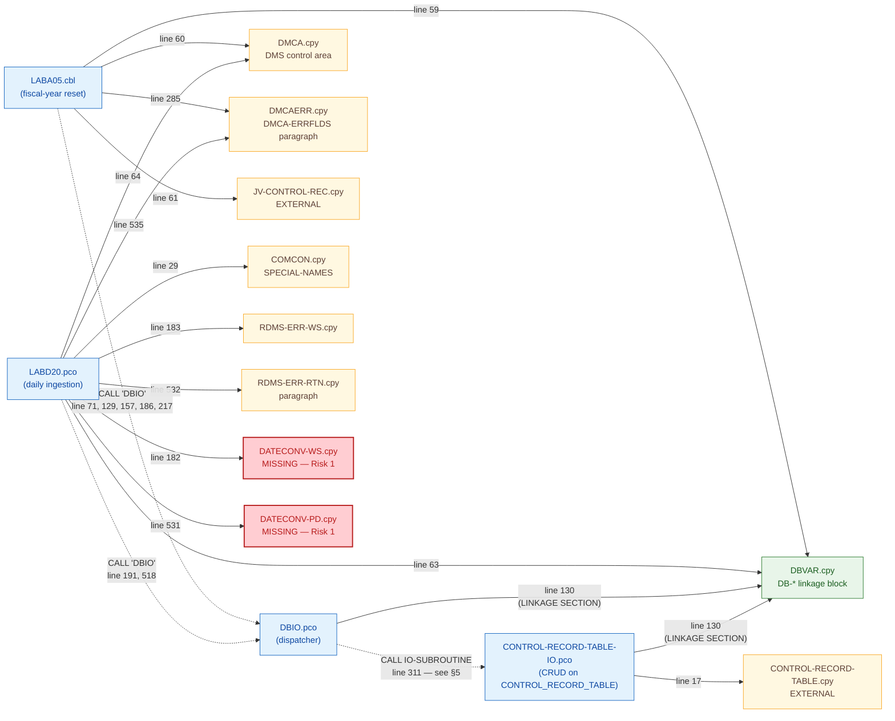
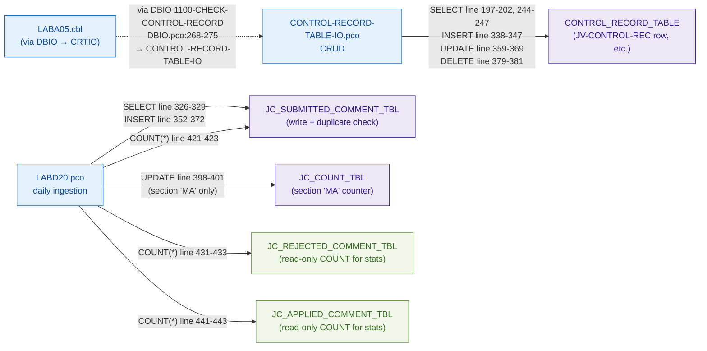
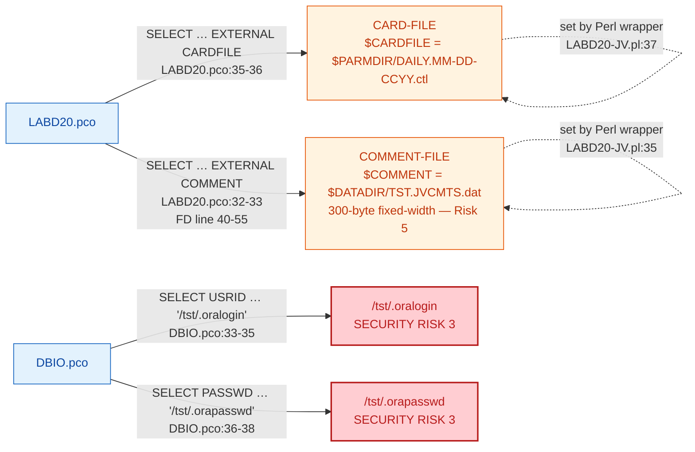
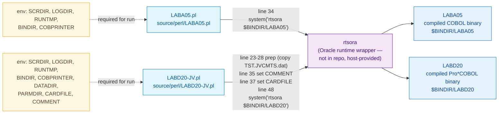

# Detailed dependency map — JV COBOL/Pro*COBOL programs

> **Status:** demo / prep — pending SME review.
> Companion to [`MIGRATION-PLAN.md`](../MIGRATION-PLAN.md), [`RISKS-AND-GAPS.md`](../RISKS-AND-GAPS.md), [`ASSUMPTIONS-AND-PLACEHOLDERS.md`](../ASSUMPTIONS-AND-PLACEHOLDERS.md), and the baseline [`analysis/dependency-map.md`](../../analysis/dependency-map.md).
>
> **Scope:** `LABA05.cbl`, `LABD20.pco`, `DBIO.pco`, `CONTROL-RECORD-TABLE-IO.pco` and their copybooks, Oracle tables, external files, Perl wrappers, and runtime environment.
>
> **How to read citations:** every node and edge below cites `path:line` against the customer-supplied source. Anything inferred (i.e. not literally in source) is called out as `// inferred` or `// RISK`.

---

## 1. Program → copybook map



**Notes**

- Two copybooks — `DATECONV-WS` and `DATECONV-PD` — are referenced by `LABD20.pco:182` and `LABD20.pco:531` but are not supplied in `source/copybooks/`. They define `FROM-CYMD-DT`, `CHECK-CYMD-DT`, and `DATE-IS-VALID` (used at `LABD20.pco:266-268`). See **Risk 1** in [`RISKS-AND-GAPS.md`](../RISKS-AND-GAPS.md).
- `DBIO.pco` literally `COPY`s only `DBVAR` (line 130, inside `LINKAGE SECTION`). It does **not** include `DMCA`, `COMCON`, `RDMS-ERR-WS`, or `RDMS-ERR-RTN`. It does, however, define a parallel mini-DMCA semantically (`CONTROL-RECORD-TABLE`, `JV-COMMENT-REC`, `JV-TRAN-REC` at `DBIO.pco:107-121`) and shares `DBVAR` with its callers and callees. The `DMCA` / `RDMS-*` / `COMCON` group is owned by the **callers** (`LABA05`, `LABD20`), not by `DBIO` itself. // inferred from absence of `COPY` statements in `DBIO.pco`.
- `DBVAR.cpy` carries `DB-SQLCODE-NUM` and the DMS-style `DB-RTNCODE-DMS` (`DBVAR.cpy:14-21`) — it is the contract surface for every program in this graph.

---

## 2. Program → Oracle table map



**Notes**

- `LABD20` writes only to `JC_SUBMITTED_COMMENT_TBL` and (conditionally, for section `'MA'`) `JC_COUNT_TBL`. The other two `JC_*` tables are read-only inside `LABD20` — used only for end-of-job statistics (`LABD20.pco:421-446`).
- `LABA05` never references an Oracle table by name; the DMS record name `JV-CONTROL-REC` is rewritten to the `CONTROL_RECORD_TABLE` row `('JV-CONTROL-REC', 0001)` inside `DBIO.pco:268-275`, then delegated to `CONTROL-RECORD-TABLE-IO.pco`. See §5.
- Schema citations: [`database/descriptions/describe CONTROL_RECORD_TABLE.txt`](../../database/descriptions/describe%20CONTROL_RECORD_TABLE.txt), [`describe JC_SUBMITTED_COMMENT_TBL.txt`](../../database/descriptions/describe%20JC_SUBMITTED_COMMENT_TBL.txt), [`describe JC_COUNT_TBL.txt`](../../database/descriptions/describe%20JC_COUNT_TBL.txt), [`describe JC_REJECTED_COMMENT_TBL.txt`](../../database/descriptions/describe%20JC_REJECTED_COMMENT_TBL.txt), [`describe JC_APPLIED_COMMENT_TBL.txt`](../../database/descriptions/describe%20JC_APPLIED_COMMENT_TBL.txt).

---

## 3. Program → external file map



**Notes**

- `LABD20`'s two input files are bound via `ASSIGN TO EXTERNAL` environment-variable names (`CARDFILE`, `COMMENT`); the **values** are injected by `LABD20-JV.pl` lines 35 and 37 (see §4 and §7).
- `CARD-FILE` is a single fixed-format date line (`PIC X(10)` + filler, `LABD20.pco:57-60`) read by `LABD20-HOUSE-KEEPING` (`LABD20.pco:223-234`) to derive the SQL date stamp.
- `COMMENT-FILE` is the JV comment feed (`TST123-COMMENT-REC` at `LABD20.pco:42-55`, 300 bytes per record). See **Risk 5** for byte-precision concerns (e.g. `TST123-COMMENT-APPROVER` is `PIC X(14)` in the live record at line 55, with the historical `PIC X(20)` version commented out at line 54).
- `DBIO.pco:33-38` hard-codes hostname-relative paths `/tst/.oralogin` and `/tst/.orapasswd` for the Oracle user/password. **Risk 3 (HIGH, security)** — see [`RISKS-AND-GAPS.md#risk-3`](../RISKS-AND-GAPS.md). The modernized Python dispatcher reads `ORACLE_USER` / `ORACLE_PASSWORD` from env vars instead.
- `DBIO` also reads `ORACLE_SID` from the **process environment** (`DBIO.pco:165-166`: `DISPLAY 'ORACLE_SID' UPON ENVIRONMENT-NAME` then `ACCEPT SRVR FROM ENVIRONMENT-VALUE`). Listed in §7.

---

## 4. Perl → COBOL orchestration map



**Notes**

- `rtsora` is invoked as a shell command, expected on `$PATH`. It is **not** part of this repository — it is a host-supplied Oracle pre-compiled-binary runtime launcher. See **Risk 10** in [`RISKS-AND-GAPS.md`](../RISKS-AND-GAPS.md) and §7 below.
- Neither Perl wrapper passes command-line arguments to the COBOL binary. Every input is delivered via env vars or `ASSIGN TO EXTERNAL …` file bindings.
- `LABD20-JV.pl` also performs pre/post copy of `TST.JVCMTS.dat` into a Generation-Data-Group-style archive (`PLABD-A.LABSAVECMTS.<seq>.dat`) before invoking `rtsora` (lines 26-34, 53-54). This is part of the pipeline behavior, not the COBOL contract — captured here for completeness.

### Env-vars set / read by each Perl wrapper (read in §7 for full table)

| Env var | LABA05.pl | LABD20-JV.pl | Read by COBOL? |
| --- | --- | --- | --- |
| `SCRDIR` | line 9 | line 9, 26, 53 | no |
| `LOGDIR` | lines 10, 45 | lines 10, 61 | no |
| `RUNTMP` | lines 17-21, 44-46, 48 | lines 17-21, 60-62, 64 | no |
| `BINDIR` | lines 24, 34 | lines 38, 48 | no (path passed to `rtsora`) |
| `COBPRINTER` | line 21 (set) | line 21 (set) | yes — COBOL `DISPLAY UPON PRINTER` |
| `DATADIR` | — | lines 23, 24, 27, 28, 35 | no |
| `PARMDIR` | — | line 37 | no |
| `CARDFILE` | — | line 37 (set) | **yes** — `LABD20.pco:35` `ASSIGN TO EXTERNAL CARDFILE` |
| `COMMENT` | — | line 35 (set) | **yes** — `LABD20.pco:32` `ASSIGN TO EXTERNAL COMMENT` |
| `ORACLE_SID` | — (implicit via `rtsora`) | — (implicit via `rtsora`) | **yes** — `DBIO.pco:165-166` |

---

## 5. DBIO dynamic dispatch resolution table

`DBIO.pco` resolves the I/O subroutine in two stages:

1. **`1100-CHECK-CONTROL-RECORD`** (`DBIO.pco:267-276`) — a hard-coded override for `JV-CONTROL-REC`.
2. **`1000-IO-MODULE-NAME`** (`DBIO.pco:228-260`) — generic name-building: strip `-REC`, append `-IO` (or `-CYMD-IO` if `DB-MISC = 'USE GREGORIAN'`).

The resolved `IO-SUBROUTINE` is then invoked dynamically at `DBIO.pco:311`:

```
CALL IO-SUBROUTINE USING DB-TABLE-NAME
                         DB-FUNCTION
                         …
                         DB-CONSTRAINT.
```

### Dispatch resolution table

| Input `DB-DMSREC-NAME` | Path | Derived `DB-TABLE-NAME` | Derived `IO-SUBROUTINE` | Static handler in repo? | Used by |
| --- | --- | --- | --- | --- | --- |
| `JV-CONTROL-REC` | override `1100-CHECK-CONTROL-RECORD` (`DBIO.pco:268-275`) | `CONTROL-RECORD-TABLE` (line 274) | `CONTROL-RECORD-TABLE-IO` (line 275) | **YES** — `source/procobol/CONTROL-RECORD-TABLE-IO.pco` | `LABA05.cbl:152, 181` (FETCH / UPDATE on JV-CONTROL-REC) |
| `JV-COMMENT-REC` | generic, strip `-REC` then `-IO` (`DBIO.pco:233-260`) | (unchanged) | `JV-COMMENT-IO` | **NO** — not in `source/procobol/` | None of the supplied callers; declared at `DBIO.pco:112-114` as a placeholder. **RISK 4** |
| `JV-TRAN-REC` | generic | (unchanged) | `JV-TRAN-IO` | **NO** | Same as above; declared at `DBIO.pco:116-121`. **RISK 4** |
| `TST-ACTIVITY-REC` | generic | (unchanged) | `TST-ACTIVITY-IO` | **NO** | Referenced inside `1200-CHECK-DB-SET-NAME` (`DBIO.pco:282-284`) but no caller in supplied source. **RISK 4** |
| `TST-QUE-REC` | generic | (unchanged) | `TST-QUE-IO` | **NO** | Reached only when `DB-SET-NAME = 'TST-INFO-TO-TST-ACTIVITY-QUE'` via `1300-SELECT-DUMMY` (`DBIO.pco:292-293`). **RISK 4** |
| (blank `DB-DMSREC-NAME`) | generic, fallback uses `DB-TABLE-NAME` (`DBIO.pco:250-260`) | (caller-supplied) | `<DB-TABLE-NAME>-IO` | depends on caller-supplied table name | None of the supplied callers populate `DB-TABLE-NAME` directly. **RISK 4** |
| any of the above, with `DB-MISC = 'USE GREGORIAN'` | generic Gregorian path (`DBIO.pco:241-249`, 251-254) | (unchanged) | `<name>-CYMD-IO` (e.g. `CONTROL-RECORD-CYMD-IO`) | **NO** | No caller in supplied source sets `DB-MISC = 'USE GREGORIAN'`. **RISK 4** — CHG-645 path. |

### What the two supplied programs actually exercise

| Caller | Function | DB-DMSREC-NAME passed | Path through DBIO | Final handler |
| --- | --- | --- | --- | --- |
| `LABA05.cbl:71` | `CONNECT` | (uninitialized — only `DB-FUNCTION = 'CONNECT'`) | `0000-MAIN` `WHEN DB-CONNECT` (`DBIO.pco:184-187`) — early exit | — (no IO-SUBROUTINE called) |
| `LABA05.cbl:129` | `COMMIT / DEPART` | initialized to spaces | `WHEN DB-COMMIT` (`DBIO.pco:188-192`) — early exit | — |
| `LABA05.cbl:157` | `SELECT / FETCH` | `'JV-CONTROL-REC'` | `1000-IO-MODULE-NAME` → `1100-CHECK-CONTROL-RECORD` override (`DBIO.pco:268-275`) | `CONTROL-RECORD-TABLE-IO` |
| `LABA05.cbl:186` | `UPDATE / MODIFY` | `'JV-CONTROL-REC'` | same as above | `CONTROL-RECORD-TABLE-IO` |
| `LABA05.cbl:217` | `ROLLBACK / DEPART` | initialized to spaces | `WHEN DB-ROLLBACK` (`DBIO.pco:193-197`) — early exit | — |
| `LABD20.pco:191` | `CONNECT` | (uninitialized — only `DB-FUNCTION = 'CONNECT'`) | `WHEN DB-CONNECT` early exit | — |
| `LABD20.pco:518` | `ROLLBACK / DEPART` | initialized to spaces | `WHEN DB-ROLLBACK` early exit | — |

**Conclusion:** In the supplied codebase only one dynamic-dispatch path is actually reached: `JV-CONTROL-REC → CONTROL-RECORD-TABLE-IO`. The other paths in the table above are reachable in principle but **cannot be statically verified from this repo** — they are runtime-resolved CALL targets that may or may not exist on the customer's compiled library. Tracked as **Risk 4** in [`RISKS-AND-GAPS.md`](../RISKS-AND-GAPS.md) and Assumption **A-3** in [`ASSUMPTIONS-AND-PLACEHOLDERS.md`](../ASSUMPTIONS-AND-PLACEHOLDERS.md).

---

## 6. SQLCA / SQLCODE flow (Pro*COBOL embedded SQL)

```mermaid
sequenceDiagram
  autonumber
  participant CALLER as LABD20<br/>(MAINLINE / TST123-COMMENT-PROCESS)
  participant SQLCA as SQLCA<br/>(EXEC SQL INCLUDE SQLCA)
  participant ORACLE as Oracle / Pro*COBOL runtime
  participant DBIO as DBIO.pco
  participant TRANS as DBIO 5300-TRANSLATE-SQLCODE
  participant DBVAR as DBVAR.cpy<br/>(DB-RTNCODE-DMS / ERROR-NUM alias)
  participant ROLLBK as LABD20 9999-ROLL-BACK

  Note over CALLER,SQLCA: LABD20 embeds SQLCA at LABD20.pco:135 (INCLUDE SQLCA)
  CALLER->>ORACLE: EXEC SQL SELECT … INTO :WS-CHECK-NUMBER<br/>FROM JC_SUBMITTED_COMMENT_TBL<br/>(LABD20.pco:325-330)
  ORACLE-->>SQLCA: populate SQLCODE / SQLERRMC
  CALLER->>SQLCA: IF SQLCODE NOT = 0 AND 100<br/>(LABD20.pco:331)
  alt SQLCODE not in {0, 100}
    CALLER->>ROLLBK: GO TO 9999-ROLL-BACK<br/>(LABD20.pco:332)
    ROLLBK->>ROLLBK: MOVE SQLCODE TO WS-SQLCODE<br/>(LABD20.pco:500)
    ROLLBK->>ROLLBK: PERFORM RDMS-ERR-RTN THRU RDMS-ERR-RTN-X<br/>(LABD20.pco:503; copybook RDMS-ERR-RTN.cpy:17-37)
    ROLLBK->>DBIO: CALL 'DBIO' DB-FUNCTION='ROLLBACK'<br/>DB-FUNCTION-TYPE='DEPART'<br/>(LABD20.pco:514-527)
    DBIO->>ORACLE: EXEC SQL ROLLBACK END-EXEC<br/>(DBIO.pco:193-197)
    DBIO->>TRANS: PERFORM 5300-TRANSLATE-SQLCODE
    TRANS-->>DBVAR: MOVE '0000' TO DB-RTNCODE-DMS (success path)
    ROLLBK->>ROLLBK: STOP RUN (LABD20.pco:529)
  else SQLCODE = 0 or 100
    CALLER->>CALLER: continue (e.g. PERFORM CREATE-COMMENT-RECORD)
  end

  Note over CALLER,DBIO: --- DMS-style path: LABA05 → DBIO ---
  participant LABA05 as LABA05.cbl
  LABA05->>DBIO: CALL 'DBIO' (e.g. SELECT FETCH on JV-CONTROL-REC)<br/>(LABA05.cbl:157-165)
  DBIO->>DBIO: 1000-IO-MODULE-NAME → CALL IO-SUBROUTINE<br/>(DBIO.pco:298-326)
  DBIO->>ORACLE: EXEC SQL (inside CONTROL-RECORD-TABLE-IO)
  ORACLE-->>SQLCA: SQLCODE
  alt SQLERROR (negative SQLCODE)
    ORACLE->>DBIO: WHENEVER SQLERROR GO TO 9999-ERROR<br/>(DBIO.pco:155-157)
    DBIO->>DBVAR: 9999-ERROR — MOVE SQLCODE TO DB-SQLCODE-NUM<br/>MOVE SQLERRMC TO DB-MESSAGE<br/>(DBIO.pco:402-404)
  else success
    DBIO->>DBIO: MOVE SQLCODE TO DB-SQLCODE-NUM (inside child IO module)
  end
  DBIO->>TRANS: PERFORM 5300-TRANSLATE-SQLCODE THRU 5300-EXIT<br/>(DBIO.pco:324, 374-398)
  TRANS->>DBVAR: SQLCODE → 4-char DMS code<br/>0→'0000', 100→'0013' or '0007',<br/>-1→'0005', -8103→'0000',<br/>OTHER→'9999'
  DBIO-->>LABA05: GOBACK<br/>(DBIO.pco:226)
  LABA05->>LABA05: PERFORM DMCA-ERRFLDS<br/>MOVE DB-RTNCODE-DMS TO ERROR-NUM<br/>(DMCAERR.cpy:5; LABA05.cbl:80, 166, 195)
  LABA05->>LABA05: IF ERROR-NUM EQUAL '0000' …<br/>(LABA05.cbl:92, 139, 171, 196)
```

**Notes**

- `LABD20` uses **two distinct error paths**:
  1. **Embedded SQL path** (`SQLCODE NOT = 0` → `GO TO 9999-ROLL-BACK`) — at `LABD20.pco:331-333, 373-375, 402-404, 414-416, 424-426, 434-436, 444-446`.
  2. **DMS-style DBIO path** (`DBIO` returns `DB-RTNCODE-DMS`, aliased as `ERROR-NUM` via `DMCAERR.cpy:5`) — used for `CONNECT` and `ROLLBACK` calls (`LABD20.pco:189-206, 514-527`).
- `LABA05` uses **only the DMS-style path** — every database operation is funneled through `DBIO` and inspected via `ERROR-NUM` (`LABA05.cbl:92, 139, 171, 196`). It never inspects `SQLCODE` directly.
- The translation table `5300-TRANSLATE-SQLCODE` (`DBIO.pco:374-398`) is the single point where Oracle SQLCODE values are mapped to the 4-character DMS return code carried in `DB-RTNCODE-DMS`. See **Risk 6** in [`RISKS-AND-GAPS.md`](../RISKS-AND-GAPS.md) and reproduced verbatim in [`MIGRATION-PLAN.md`](../MIGRATION-PLAN.md).

### Translation table reproduced

| `DB-SQLCODE-NUM` (Oracle) | `DB-RTNCODE-DMS` (set by DBIO 5300) | Notes |
| --- | --- | --- |
| `0` | `'0000'` | DB-OK (`DBVAR.cpy:15`) |
| `100` | `'0013'` (default) → `'0007'` if `DB-SET-NAME > SPACES AND DB-FUNCTION-TYPE NOT = 'FETCH OWNER'` | NOT-FOUND vs END-OF-SET (`DBIO.pco:378-383`) |
| `-1` | `'0005'` | DUP-KEY (`DBIO.pco:384-385`) |
| `-8103` | `'0000'` + diagnostic display | "RECEIVED ORACLE ERROR -8103, CONTINUE…" — treats stale rowid as success (`DBIO.pco:386-395`) |
| OTHER | `'9999'` | Generic error (`DBIO.pco:396-397`) |

Risk 6: this translation is lossy (every unknown SQL error collapses to `'9999'`) and ties future SQL changes to legacy DMS callers.

---

## 7. Environment-variable & runtime-dependency table

> The Pro*COBOL/COBOL binaries are launched by the Perl wrappers. Every name below is a runtime dependency that **must be present in the environment** for the program to run.

| Name | Type | Set by | Read by | Purpose / Notes |
| --- | --- | --- | --- | --- |
| `SCRDIR` | env var | external (caller) | `LABA05.pl:9`, `LABD20-JV.pl:9, 26, 53` | Directory of helper Perl scripts (`TIMESTAMP.pl`, `GETGDGNO.pl`). |
| `LOGDIR` | env var | external | `LABA05.pl:10, 45`, `LABD20-JV.pl:10, 61` | Location of run logs. |
| `RUNTMP` | env var | external | `LABA05.pl:17, 18, 21, 44-46, 48`, `LABD20-JV.pl:17, 18, 21, 60-62, 64` | Scratch dir for COBOL printer redirect. |
| `BINDIR` | env var | external | `LABA05.pl:24, 34`, `LABD20-JV.pl:38, 48` | Path to compiled COBOL binaries. |
| `COBPRINTER` | env var | `LABA05.pl:21`, `LABD20-JV.pl:21` (each wrapper sets it) | COBOL runtime — receives `DISPLAY UPON PRINTER` output | Indirection script (`*.cobprtr.<ts>.ksh`) that appends to a log file. |
| `DATADIR` | env var | external | `LABD20-JV.pl:23, 24, 27, 28, 35` | Input/output data files for LABD20-JV. |
| `PARMDIR` | env var | external | `LABD20-JV.pl:37` | Location of `DAILY.MM-DD-CCYY.ctl` (read into `CARD-FILE`). |
| `CARDFILE` | env var | `LABD20-JV.pl:37` (Perl sets it to `$PARMDIR/DAILY.MM-DD-CCYY.ctl`) | **COBOL** `LABD20.pco:35-36` (`ASSIGN TO EXTERNAL CARDFILE`) | Resolves the OS path for `CARD-FILE`. |
| `COMMENT` | env var | `LABD20-JV.pl:35` (Perl sets it to `$DATADIR/TST.JVCMTS.dat`) | **COBOL** `LABD20.pco:32-33` (`ASSIGN TO EXTERNAL COMMENT`) | Resolves the OS path for `COMMENT-FILE`. |
| `ORACLE_SID` | env var | external (host-level Oracle setup) | **COBOL** `DBIO.pco:165-166` (`DISPLAY 'ORACLE_SID' UPON ENVIRONMENT-NAME / ACCEPT SRVR FROM ENVIRONMENT-VALUE`) | DB instance name appended to user/password string for the EXEC SQL CONNECT (`DBIO.pco:168-173`). |
| `rtsora` | command on `$PATH` | host install (Oracle pre-compiler runtime; not in repo) | `LABA05.pl:34`, `LABD20-JV.pl:48` | Oracle Pro*COBOL runtime wrapper. Sets up Oracle client libraries before `exec`ing the COBOL binary. Without `rtsora` neither program can `EXEC SQL CONNECT`. |
| `/tst/.oralogin` | file on disk | host (manual provisioning) | **COBOL** `DBIO.pco:33-35, 41-42, 162-164` | Oracle username, 20 chars. **Risk 3 (HIGH security).** |
| `/tst/.orapasswd` | file on disk | host (manual provisioning) | **COBOL** `DBIO.pco:36-38, 44-45, 162-164` | Oracle password, 20 chars. **Risk 3 (HIGH security).** |
| `TIMESTAMP.pl` | helper script | external (`$SCRDIR/TIMESTAMP.pl`) | `LABA05.pl:9`, `LABD20-JV.pl:9` | Provides timestamp for log filenames. **Not in this repo.** |
| `GETGDGNO.pl` | helper script | external (`$SCRDIR/GETGDGNO.pl`) | `LABD20-JV.pl:26, 53` | Provides next Generation Data Group sequence number. **Not in this repo.** |

### Implications for modernization

- The modernized Python pipeline (per [`MIGRATION-PLAN.md`](../MIGRATION-PLAN.md)) replaces each of these with explicit configuration: `ORACLE_USER`, `ORACLE_PASSWORD`, `ORACLE_DSN`, `CARDFILE`, `COMMENTFILE`, `LOGDIR`. The `/tst/.ora*` files are no longer read from disk (Risk 3 mitigated).
- `rtsora`, `TIMESTAMP.pl`, and `GETGDGNO.pl` have **no analogue** required in the Python version — process startup, timestamps, and GDG sequencing are handled in-process.
- See **Risk 10 (Perl wrapper environment dependencies)** in [`RISKS-AND-GAPS.md`](../RISKS-AND-GAPS.md).

---

## Risk cross-references

| Section | Risks cross-linked |
| --- | --- |
| §1 Program → copybook map | **Risk 1** (DATECONV-WS / DATECONV-PD missing) |
| §3 Program → external file map | **Risk 3** (HIGH security: `/tst/.oralogin`, `/tst/.orapasswd`) · **Risk 5** (fixed-width record byte precision) |
| §5 DBIO dynamic dispatch table | **Risk 4** (dynamic subroutine dispatch in DBIO — unresolvable paths) · Assumption A-3 |
| §6 SQLCA / SQLCODE flow | **Risk 6** (SQLCODE → DMS translation) · **Risk 7** (transaction rollback paths) |
| §7 Environment variables | **Risk 3** · **Risk 10** (Perl wrapper environment dependencies) |

---

## 8. Missing-node summary

Consolidated view of everything referenced by the supplied source that is **not** present in this repo:

| Missing node | Referenced by | Severity | Mitigation in modernized code |
| --- | --- | --- | --- |
| `DATECONV-WS` (copybook) | `LABD20.pco:182` (`COPY DATECONV-WS.`) | HIGH — affects date validation correctness | Stubbed in [`migration/converted-code/python/labd20_loader.py`](../converted-code/python/labd20_loader.py) `check_cymd_dt` with `# PLACEHOLDER` marker; Risk 1. |
| `DATECONV-PD` (copybook) | `LABD20.pco:531` (`COPY DATECONV-PD.`), referenced by `PERFORM CHECK-CYMD-DT` at `LABD20.pco:266-268` | HIGH | Same as above. |
| `JV-COMMENT-IO` (subroutine) | Inferred from `DBIO.pco:112-114` placeholder + dispatch path `DBIO.pco:233-260` | MEDIUM — out of scope for the supplied callers (LABA05, LABD20 never dispatch to it) | Not exercised; SME confirmation required (Risk 4). |
| `JV-TRAN-IO` (subroutine) | Inferred from `DBIO.pco:116-121` placeholder + dispatch path `DBIO.pco:233-260` | MEDIUM | Same. |
| `TST-ACTIVITY-IO`, `TST-QUE-IO` (subroutines) | Inferred from `DBIO.pco:282-293` (`1200-CHECK-DB-SET-NAME` / `1300-SELECT-DUMMY`) | MEDIUM | Same. |
| Any `*-CYMD-IO` Gregorian-path subroutine | `DBIO.pco:241-249, 251-254` (`DB-MISC = 'USE GREGORIAN'` branch, CHG-645) | LOW — no supplied caller sets `DB-MISC = 'USE GREGORIAN'` | Path is dead in the supplied codebase; SME confirmation required. |
| Inserts into `JC_REJECTED_COMMENT_TBL` / `JC_APPLIED_COMMENT_TBL` | Only `COUNT(*)` references at `LABD20.pco:431-433, 441-443` | LOW — only end-of-job reporting affected | Reads only; SME to confirm where these tables are written by other jobs not in this repo. |
| `rtsora` runtime, `TIMESTAMP.pl`, `GETGDGNO.pl` | `LABA05.pl:34, 9`; `LABD20-JV.pl:48, 9, 26, 53` | LOW — replaced wholesale in the Python pipeline | No direct equivalent needed (Python uses in-process startup, `datetime`, and explicit sequence management). |

---

> **Demo / prep — pending SME review.** Every claim above is grounded in `source/*` and `database/descriptions/*` at the file:line citations shown. Inferred behavior (e.g. dispatch paths not exercised by the supplied callers) is explicitly marked. Awaiting customer SME confirmation of: (a) DATECONV-WS/PD contents, (b) the full set of valid `DB-DMSREC-NAME` → `*-IO` handlers in the customer's compiled library, (c) any caller that uses the `DB-MISC = 'USE GREGORIAN'` Gregorian-date path, (d) whether `/tst/.ora*` files can be removed from production.
